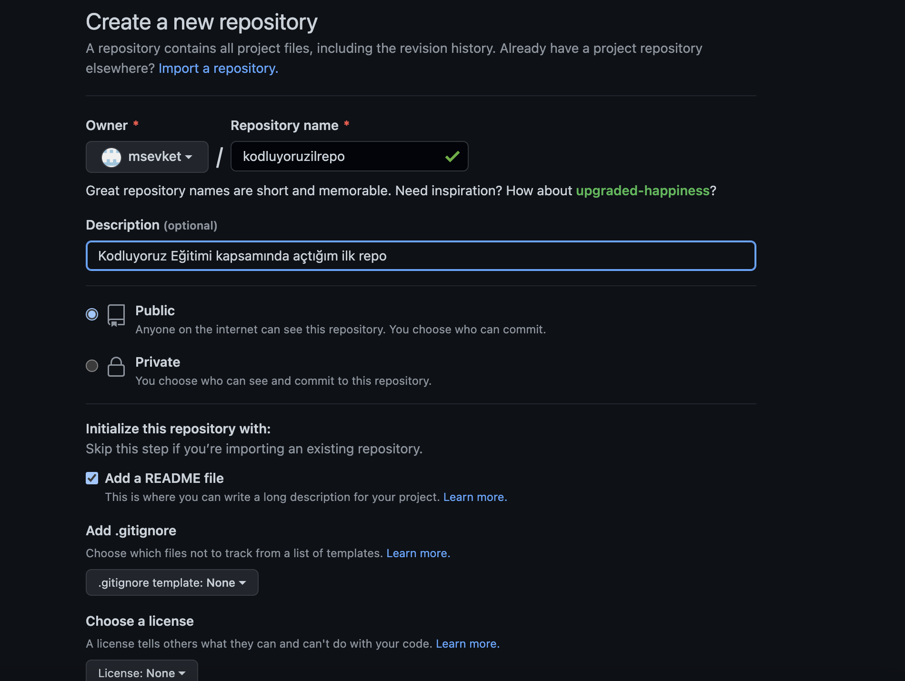

# kodluyoruzilkrepo
Kodluyoruz Eğitimi kapsamında açtığım ilk repo. İçeriğinde bir adet **README** dosyası, bir adet de ***index.html*** barındırıyor.



## Installation

Öncelikle projeyi klonlayın. Burada "*msevket*" yazan yere kendi
github kullanıcı adınızı yazacaksınız.

 ```
 git clone https://github.com/msevket/kodluyoruzilkrepo.git
 ```

 ## Usage

 Daha sonra projeyi Vscode'da açın.
 Linux için:
 ```
 cd kodluyoruzilkrepo
 code .
 ```
 Diğer OS'ler için de web üzerinden arama yapabilirsiniz.
 
 ## Contributing
Pull requestler kabul edilir. Büyük değişiklikler için, lütfen önce neyi değiştirmek 
istediğinizi tartışmak için bir konu açınız.
## License
[MIT LICENSE](https://choosealicense.com/licenses/mit/)